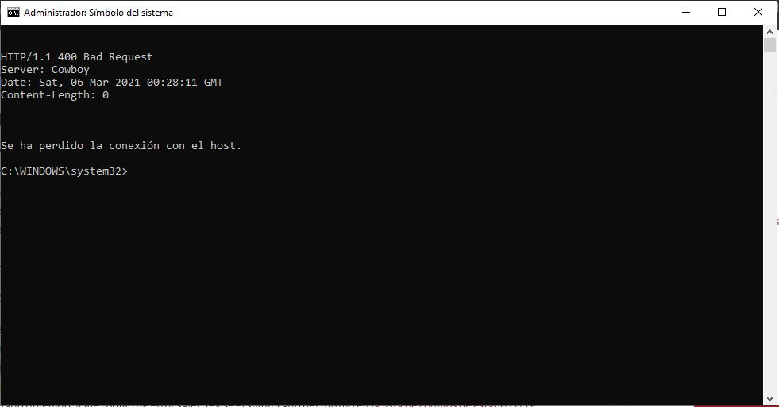

#Laboratorio 5

##Parte 1
### Punto 3

Este mensaje hace referencia que el cliente hizo una solicitud incorrecta, ya sea por sintaxis de solicitud mal formada, tamaño demasiado grande, encuadre de mensaje de solicitud no válido o enrutamiento de solicitud engañoso, etc.

**Tipos de errores:**
1xx: Este tipo de mensajes de error indican que la solucitud es correcta pero está procesando.
2xx: Este tipo de mensajes de error indican que la solicitud es correcta y fue completada exitosamente.
3xx: Este tipo de mensajes de error indican que la solicitud requiere una accion adicional para completarse como puede ser un redireccionamiento.
4xx: Este tipo de mensajes de error indican que la solicitud tuvo un error debido al cliente.
5xx: Este tipo de mensajes de error indican que la solicitud tuvo un error debido al servidor.

### Punto 4

### Punto 5
La diferencia entre get y post está en la forma de enviar datos. El método GET envía los datos por medio de la URL, el método POST los envía de forma oculta a través dee formularios.
Existen los siguientes tipos de peticiones:

El comando **curl -v**
Incluye el encabezados de respuesta del protocolo en la salida tambien el encabezado de la solicitud.
El comando **curl -i**
Tambien incluye el encabezado de la respuesta en la salida, así como otra informacion relevante pero este no permite visualizar el encabezado de la solicitud.